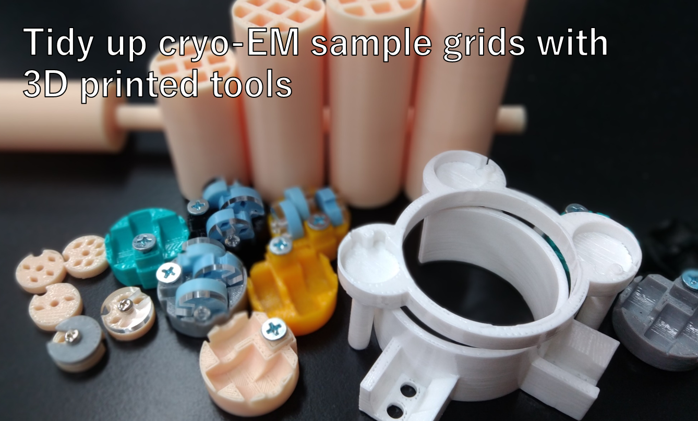

# CryoGridTools  
Designs of cryo-EM tools described in "Tidy up cryo-EM sample grids with 3D printed tools" for 3D printing.
## References
https://doi.org/10.1016/j.jsb.2019.107414 
https://doi.org/10.1016/j.jsb.2019.04.011

## How to 3D print
STL files can be directly fed to a 3D printer.
All tools were designed by Blender (https://www.blender.org/).  
  
## Recommendation
An FDM 3D printer with ABS filaments is suitable for production of the tools.
A slower head speed, a correct temperature (~ 100˚C) of the base plate and a controled cooling rate are required for success of 3D printing.

## Contents
### GridCaseStacker
Storage for disk-shaped grid cases in liquid nitrogen. The grid case stacker holds three grid cases. The five stackers can be kept inside a wide-use centrifuge tube. The steel flat-head metal screw with a diameter of ~ 3.2 mm and a length of ~ 12 mm on the stacker is fitted with a CrystalWand Magnetic.

### GridCaseOrientator
Grid case orientator for easy pick up of the grid case with tweezers. Fitted inside the outer space around the ethane vessel of the ethane container. A grid case with plunge-frozen grids can be dropped onto the orientator in liquid nitrogen, and the orientator supports the grid case in an upright position.

### GridCaseHolder
Holder for three disk-shaped grid cases onto its three arms. Fitted inside the outer space of the ethane container. The holder affords enough room for the orientator.

### MagneticWand1, 2
Pickup wand for the grid case stacker. MagneticWand 1 and 2 should be connected with glue, and then a small neodymium magnet (~ 6 mmφ) be glued on the tip. The stacker is easily released under liquid nitrogen by a wrenching action of the wand.

### Spacers
Spacers placed on top of the stacker inside a 50 mL conical tube for transport. Spacer 1 is desinged for five stackers in the tube. Spacer 2 ~ 5 are for four to one stackers, respectively.

### GridCase base and top
Grid cases with two- four- and six-hole slits

### RetainerStocker
Retainer stocker for JEOL CRYO ARM electron microscopes. The stocker accommodates four retainers, and is usually kept inside a desiccator till use.

### TubeHanger
TubeHanger can hang 50 ml tube with string in liquid nitrogen. This allows for smooth loading and unloading of the stackers.
  
### CryoRingKeeper and HowToUse movie

## Authors
Tasuku Hamaguchi and Koji Yonekura

